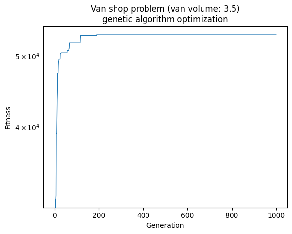

# Van-shop problem with genetic algorithms

For an introduction to genetic algorithms and related resources follow
[this link](https://github.com/Ishikawa7/Quick-paths-to-start/tree/main/Genetic%20algorithms).

## The problem

A van in a shop must be filled to transport household appliances, its load must
be optimized by maximizing the value of what is transported for a given volume.

## Data

Find the inventory of available products along wth their specifics at
[this file](./data/products.xlsx).

## Install

Download the code cloning the present repository and install its dependencies
in a fresh new python environment.

Follow the commands below to create a new virtual environment using venv.

```bash
git clone https://github.com/marcorossi5/genetic_algorithms.git
cd genetic_algorithms
python -m venv ./venv
source ./venv/bin/activate
pip install -r requirements
```

## Run the code

The code to solve the given problem can be run with the following command:

```bash
./start.sh <van_space>
```

where `van_space` is the space availble in the van.  
The allowed values for this parameter are the range `[1,5]`.

The program shows as output the list of products and their picked quantity to be
loaded on the van to maximize the transported value.

Tho following code block shows an example output of the program:

```bash
(gad) $ ./start.sh 3.5
Saved fitness vs generation figure at ./assets/fitness_vs_generation.png
Best solution:
Predicted solution occupied space: 3.439
Predicted total value: 53506.540
Predicted output based on the best solution:
       Product  Picked
0  Microwave B       5
1  Microwave C       5
2        TV 42       4
3  Microwave A       3
4   Notebook A       3
5        TV 50       3
6        TV 55       3
7   Cell phone       2
```

Additionally, the program saves a plot describing how the best fitness changes
with the different generations of the genetic algorithm, like the one below



## Experiment with different hyperparameters

The model's hyperparameters can be tuned modifying the values in the `src/settings.yaml`
configuration file.

Feel free to experiment around by changing the values of the algorithm.
